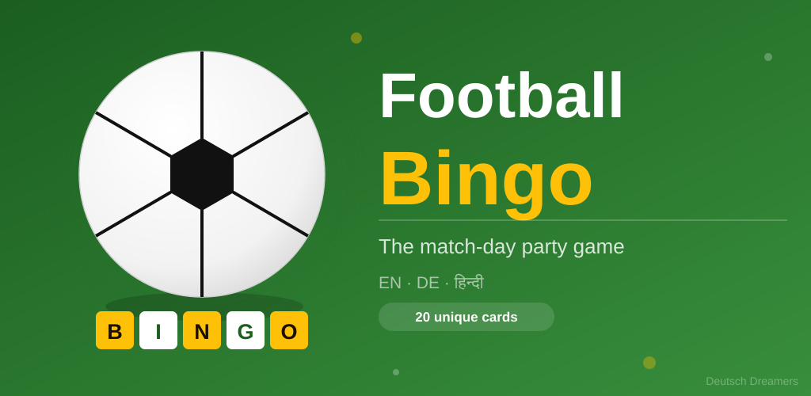
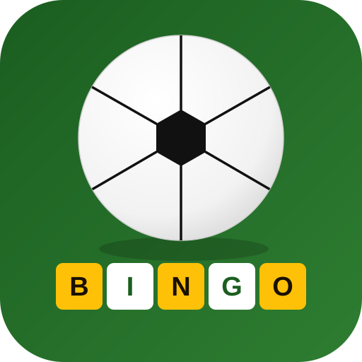

<p align="center">
  
</p>

<br>

<p align="center" >
  
</p>

<h2 align="center">Football Bingo</h2>

<p align="center" >
  A party bingo game for watching football — tap squares as events happen on screen,<br>
  race your friends to complete a row, column, or diagonal first.
</p>

<p align="center">
  
  
  
  
  
  <a href="https://github.com/ritwikshanker/Football_Bingo/releases/latest"></a>
</p>

---

## Play Now

<p align="center">
  <a href="https://ritwikshanker.github.io/Football_Bingo/">
    
  </a>
  &nbsp;
  <a href="https://play.google.com/store/apps/details?id=com.deutschdreamers.footballbingo">
    
  </a>
</p>

| | Link |
|---|---|
| 🌐 Play in browser (free, instant) | https://ritwikshanker.github.io/Football_Bingo/ |
| 📱 Join beta on Android | https://play.google.com/store/apps/details?id=com.deutschdreamers.footballbingo |
| 📦 Latest release (APK) | https://github.com/ritwikshanker/Football_Bingo/releases/latest |

---

## Screenshots

|                 Home                  |              Bingo card              |                Win!                 |
|:-------------------------------------:|:------------------------------------:|:-----------------------------------:|
|  |  |  |
|      Language &amp; card picker       |          5×5 tappable grid           |         Celebration dialog          |

---

## Features

- **5×5 bingo grid** — 44 football events per language, 25 randomly drawn per card
- **20 reproducible card numbers** — card #3 in English is always the same arrangement, so players
  can call out their number at a party without spoiling others
- **3 languages** — English, Deutsch, हिन्दी
- **Win detection** — rows, columns, and both diagonals; golden highlight + celebration dialog
- **Keep playing after a line win** — chase the full house before new cards are dealt
- **Auto-hyphenation** — long German compound words break correctly across lines
- **Portrait-locked** — the card stays still when you put the phone down

## How to play

1. Everyone opens the app and picks the **same language**
2. Each player picks a **different card number** (1–20) — this guarantees unique grids
3. Tap a square whenever that event happens on screen during the match
4. Complete a row, column, or diagonal to get **BINGO!**
5. Keep playing on the same card to aim for a full house

## Tech stack

| Layer        | Technology                                   |
|--------------|----------------------------------------------|
| Language     | Kotlin                                       |
| UI           | Jetpack Compose + Material 3                 |
| State        | Immutable `GameState` data class, `remember` |
| Min SDK      | 29 (Android 10)                              |
| Target SDK   | 36                                           |
| Build system | Gradle 9.4 with version catalogs             |

## Project structure

```
app/src/main/java/com/deutschdreamers/footballbingo/
├── BingoData.kt          # Language enum, GameState, all 44 bingo items × 3 languages
├── MainActivity.kt       # Entry point; navigates between Home, Game, and About screens
└── ui/
    ├── HomeScreen.kt     # Language picker + card number selector
    ├── BingoScreen.kt    # 5×5 grid, tap to mark, win detection + dialog
    ├── AboutScreen.kt    # App info and Deutsch Dreamers branding
    └── theme/
        ├── Color.kt      # Football green + amber colour ramps
        ├── Theme.kt      # MaterialTheme light/dark colour schemes
        └── Type.kt       # Typography
```

## Card generation

Cards are deterministic: `Random(language.ordinal × 100_000 + cardNumber)` seeds the shuffle, so the
same (language, card number) pair always produces the same 5×5 grid. With 44 items choosing 25,
there are over 1 billion possible arrangements — the 1–20 range gives practical party-sized variety
while keeping cards reproducible across sessions and devices.

## Web app (GitHub Pages)

The `docs/` folder contains a single-file web version of the game hosted at
`https://ritwikshanker.github.io/Football_Bingo/`.

**To enable GitHub Pages** (one-time setup):
1. Go to your repo → **Settings → Pages**
2. Under *Source*, choose **Deploy from a branch**
3. Branch: `main`, Folder: `/docs`
4. Click **Save** — the site is live in ~60 seconds

The web app uses the exact same seeded PRNG as the Android app, so card #3 in
English produces the identical 5×5 grid on both platforms.

## Building

```bash
./gradlew assembleDebug
```

The debug APK is written to `app/build/outputs/apk/debug/`.

## Store assets

Ready-to-upload graphics are in `store_assets/`:

| File                           | Dimensions    | Use                        |
|--------------------------------|---------------|----------------------------|
| `icon_512.png`                 | 512 × 512 px  | Play Store high-res icon   |
| `icon_512.svg`                 | scalable      | Source file                |
| `feature_graphic_1024x500.png` | 1024 × 500 px | Play Store feature graphic |
| `feature_graphic_1024x500.svg` | scalable      | Source file                |

## Credits

Made with ❤️ by 🇮🇳 in 🇩🇪 — [Deutsch Dreamers](https://github.com/ritwikshanker)

## License

MIT
